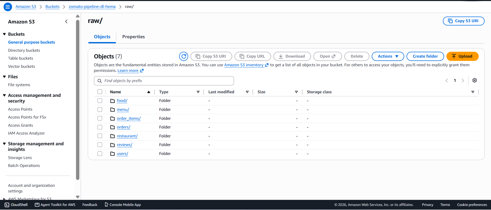
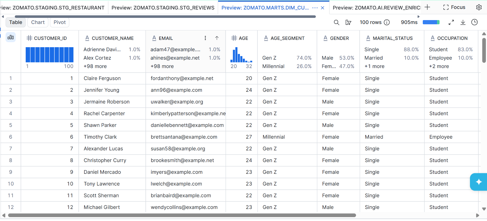
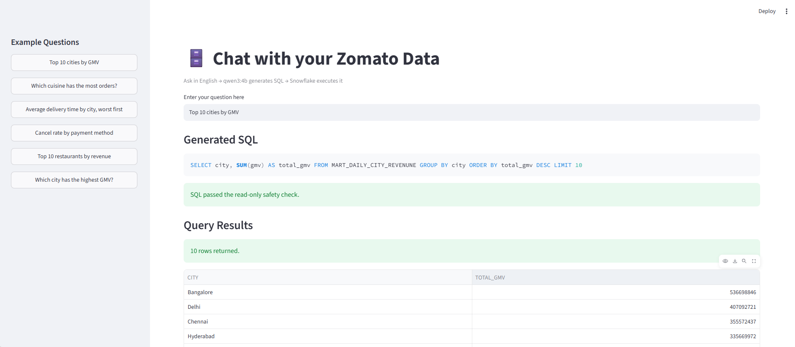
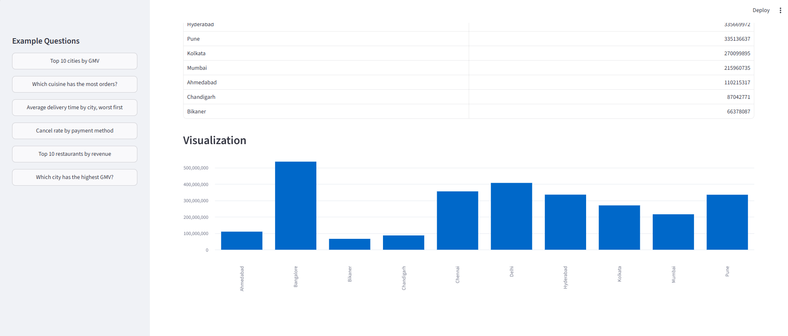
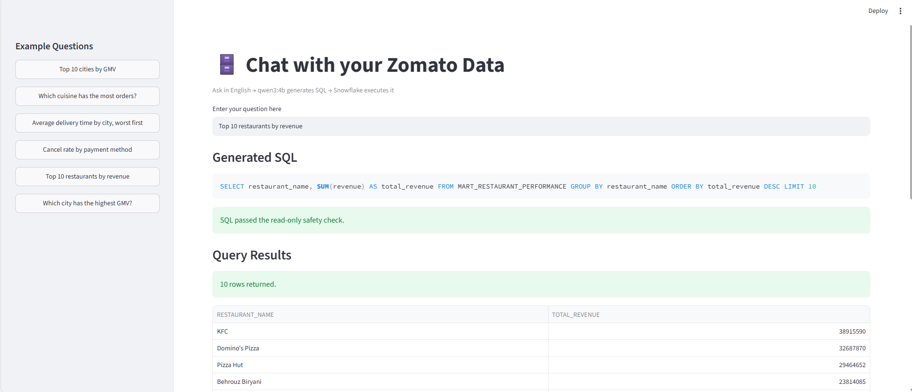
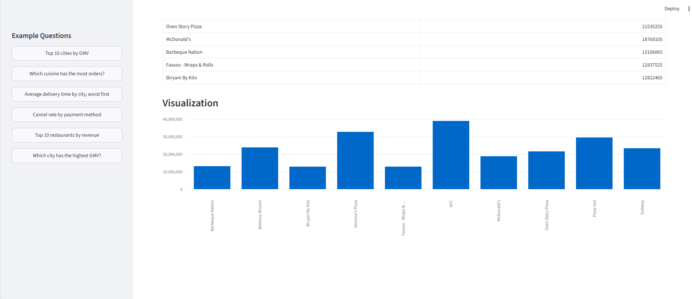
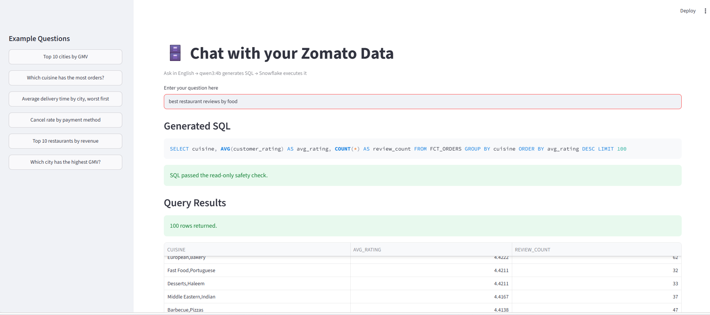
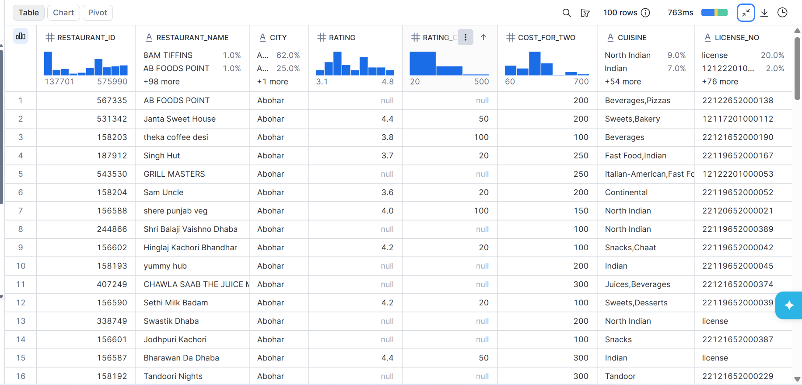
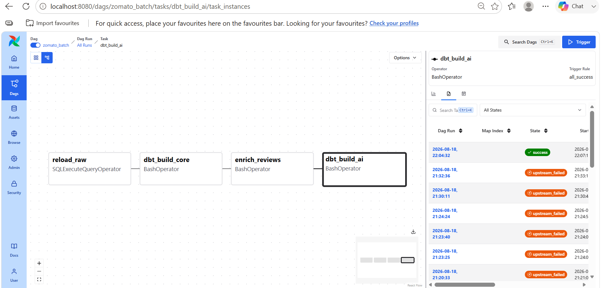

# 🍽️ Zomato Data Intelligence & AI Platform

> An end-to-end data engineering and AI platform for transforming Zomato customer and order data into analytics, NLP insights, semantic search, and natural-language business intelligence.


Note: I have use the Ollama you can also use the OpenAI if possible using this architecture.

---

## 📌 Overview

The **Zomato Data Intelligence & AI Platform** is an end-to-end data engineering and AI project that processes restaurant, customer, order, and review data through a modern data pipeline.

The platform combines **AWS, Snowflake, dbt, Apache Airflow, Python, Streamlit, Ollama, Qwen3:4B, and all-MiniLM** to build a complete workflow from raw data ingestion to AI-powered insights.

The system supports:

- Automated data ingestion
- Cloud data storage
- Snowflake data warehousing
- Data transformation using dbt
- Pipeline orchestration using Apache Airflow
- Customer review sentiment analysis
- Review topic classification
- Key issue extraction
- RAG-based semantic search
- Natural-language question answering
- Natural-language-to-SQL analytics
- Interactive Streamlit applications

---

## ✨ Key Features

### 🔄 End-to-End Data Pipeline

The project implements a complete data pipeline:

```text
Raw Data
   ↓
AWS / S3
   ↓
Snowflake RAW
   ↓
dbt Staging
   ↓
dbt Core Models
   ↓
Analytics Marts
   ↓
AI / NLP Enrichment
   ↓
AI Analytics
```

---

## ☁️ Data Engineering

The project uses **AWS S3** as the initial cloud storage and ingestion layer before
loading the Zomato datasets into **Snowflake** for transformation, modeling, and analytics.

### Data Flow

```text
Source Data
    ↓
AWS S3
    ↓
Snowflake RAW
    ↓
dbt Staging
    ↓
dbt Core
    ↓
Analytics Marts
```

### AWS S3 — Data Storage

The raw Zomato datasets are stored in an AWS S3 bucket before being loaded into
Snowflake for downstream processing.



### Snowflake Data Warehouse

After ingestion, the data is organized into logical layers within Snowflake:

```text
ZOMATO
│
├── RAW
│   └── Raw source tables
│
├── STAGING
│   └── Cleaned and standardized data
│
├── AI
│   └── AI-enriched customer reviews
│
└── MARTS
    └── Business-ready analytical models
```



This layered architecture separates **raw data, transformation logic, AI enrichment,
and analytical datasets**, making the pipeline easier to maintain and extend.

---

### 🔧 dbt Transformation Layer

The project uses **dbt** to transform raw Zomato data into analytics-ready datasets.

The transformation workflow is organized into:

```text
RAW
 ↓
STAGING
 ↓
CORE
 ↓
MARTS
 ↓
AI
```

Example analytical marts include:

- Daily city revenue
- Restaurant performance
- Delivery SLA metrics
- Customer and order analytics

The dbt project currently passes:

```text
PASS = 32
WARN = 0
ERROR = 0
SKIP = 0
NO-OP = 0
REUSED = 0
TOTAL = 32
```

---

## 🤖 NLP & AI Review Analysis

Customer reviews are enriched using a locally hosted Large Language Model through **Ollama**.

### Model

```text
Qwen3:4B
```

The model performs several NLP tasks.

### 1. Sentiment Analysis

Each review is classified as:

```text
positive
negative
neutral
```

A sentiment score is also generated between:

```text
-1.0 → Extremely Negative
 0.0 → Neutral
+1.0 → Extremely Positive
```

### 2. Topic Classification

Reviews are categorized into:

```text
food quality
delivery
pricing
service
packaging
other
```

### 3. Key Issue Extraction

For reviews containing problems, the system extracts a short description of the main issue.

Example:

```text
Review:
"Far too expensive for what you get."

Output:
Sentiment: negative
Score: -0.7
Topic: pricing
Key Issue: too expensive for what you get
```

For reviews without a clear problem:

```text
key_issue = null
```

### AI Enrichment Flow

```text
Zomato Review
      ↓
Snowflake RAW.REVIEWS
      ↓
Ollama
      ↓
Qwen3:4B
      ↓
Sentiment Analysis
      +
Topic Classification
      +
Key Issue Extraction
      ↓
ZOMATO.AI.REVIEW_ENRICHED
```

---

## 🔎 RAG-Based Review Search

The project also includes a **Retrieval-Augmented Generation (RAG)** application for searching customer reviews using natural language.

### Embedding Model

```text
all-MiniLM
```

The embedding model converts review text into numerical vectors.

```text
Customer Reviews
      ↓
all-MiniLM
      ↓
Vector Embeddings
      ↓
Similarity Search
      ↓
Top Relevant Reviews
      ↓
Qwen3:4B
      ↓
Answer
```

### Example

A user can ask:

```text
What are the common complaints about delivery?
```

The application:

1. Converts the question into an embedding
2. Compares it with review embeddings
3. Retrieves the most relevant reviews
4. Sends those reviews as context to Qwen3:4B
5. Generates an answer based on the retrieved evidence

The application also displays the retrieved reviews used to generate the answer.



---

## 💬 Chat with Zomato Reviews

The Streamlit RAG application provides an interactive interface for asking questions about customer reviews.









### Example Questions

```text
What are the common complaints about delivery?

What do customers say about pricing?

What are the worst reviews?

What do customers like about packaging?

What problems are customers reporting?
```

The application shows both:

- Generated answer
- Retrieved reviews used as evidence

This makes the result more transparent and reduces unsupported responses.

---

# 🧠 Natural Language to SQL

The project also includes a natural-language analytics application that allows users to query the Zomato warehouse using English.

Instead of manually writing SQL:

```sql
SELECT city, AVG(delivery_time_min)
FROM ...
GROUP BY city
ORDER BY ...
```

the user can ask:

```text
Average delivery time by city, worst first
```

The application uses **Qwen3:4B** to generate the SQL query.

```text
User Question
      ↓
Qwen3:4B
      ↓
SQL Generation
      ↓
Read-Only Safety Check
      ↓
Snowflake
      ↓
Query Result
      ↓
Streamlit
```

### Read-Only Protection

The generated query is checked before execution.

The application only allows:

```text
SELECT
WITH
```

queries and rejects potentially destructive operations such as:

```text
DROP
DELETE
TRUNCATE
ALTER
UPDATE
INSERT
CREATE
REPLACE
GRANT
REVOKE
```

This provides an additional safety layer between the language model and the data warehouse.

---

## 📊 Analytics

The project provides analytics across multiple business dimensions, including:

- Revenue
- GMV
- Average Order Value
- Orders
- Cancellation rate
- Delivery performance
- Customer ratings
- Restaurant performance
- City-level performance
- Cuisine-level performance



---

## 🗃️ Data Warehouse

Snowflake is organized into logical layers.

```text
ZOMATO
│
├── RAW
│   └── Raw source tables
│
├── STAGING
│   └── Cleaned and standardized data
│
├── AI
│   └── AI-enriched customer reviews
│
└── MARTS
    └── Business-ready analytical models
```

### Example AI Table

```text
ZOMATO.AI.REVIEW_ENRICHED
```

Contains:

```text
REVIEW_ID
SENTIMENT_LABEL
SENTIMENT_SCORE
TOPIC
KEY_ISSUE
MODEL
ENRICHED_AT
```

---

# ⚙️ Apache Airflow Orchestration

Apache Airflow is used to orchestrate the complete pipeline.

Current DAG:

```text
zomato_batch
```

Pipeline dependency:

```text
reload_raw
     ↓
dbt_build_core
     ↓
enrich_reviews
     ↓
dbt_build_ai
```



### Pipeline Tasks

| Task | Purpose |
|---|---|
| `reload_raw` | Loads/reloads raw source data |
| `dbt_build_core` | Builds core dbt models |
| `enrich_reviews` | Performs AI/NLP review enrichment |
| `dbt_build_ai` | Builds AI-related dbt models |

Airflow runs the tasks according to their dependencies and provides task-level monitoring and execution logs.

---

# 🏗️ System Architecture

```text
                         ┌─────────────────┐
                         │    Source Data  │
                         └────────┬────────┘
                                  │
                                  ▼
                         ┌─────────────────┐
                         │      AWS S3     │
                         └────────┬────────┘
                                  │
                                  ▼
                         ┌─────────────────┐
                         │ Snowflake RAW   │
                         └────────┬────────┘
                                  │
                                  ▼
                         ┌─────────────────┐
                         │      dbt        │
                         │ Staging / Core  │
                         └────────┬────────┘
                                  │
                                  ▼
                         ┌─────────────────┐
                         │ Snowflake MARTS │
                         └────────┬────────┘
                                  │
                    ┌─────────────┴─────────────┐
                    │                           │
                    ▼                           ▼
             ┌──────────────┐           ┌──────────────┐
             │ NLP Pipeline │           │ Analytics    │
             │  Qwen3:4B   │           │ Text → SQL   │
             └──────┬───────┘           └──────┬───────┘
                    │                           │
                    ▼                           ▼
             ┌──────────────┐           ┌──────────────┐
             │ AI Enriched  │           │  Snowflake   │
             │    Reviews   │           │   Queries    │
             └──────┬───────┘           └──────────────┘
                    │
                    ▼
             ┌──────────────┐
             │ RAG / Search │
             │ all-MiniLM   │
             └──────┬───────┘
                    │
                    ▼
             ┌──────────────────┐
             │    Streamlit     │
             │ AI Applications  │
             └──────────────────┘

                    ▲
                    │
             ┌──────┴───────┐
             │   Airflow    │
             │ Orchestration│
             └──────────────┘
```


---

# 🛠️ Technology Stack

| Category | Technologies |
|---|---|
| Programming | Python, SQL |
| Cloud | AWS S3 |
| Data Warehouse | Snowflake |
| Transformation | dbt |
| Orchestration | Apache Airflow |
| AI / LLM | Ollama, Qwen3:4B |
| Embeddings | all-MiniLM |
| RAG | Vector embeddings, cosine similarity |
| Application | Streamlit |
| Containerization | Docker |
| Data Processing | Pandas, NumPy |
| Version Control | Git / GitHub |

---

# 📁 Project Structure

```text
zomato-data-pipeline/
│
├── ai/
│   ├── enrich_reviews.py
│   ├── rag_chat.py
│   └── text_to_sql.py
│
├── airflow/
│   ├── dags/
│   ├── logs/
│   ├── Dockerfile
│   └── docker-compose.yml
│
├── data/
│   └── ...
│
├── images/
│   ├── architecture.png
│   ├── Airflow.png
│   ├── AiOutput.png
│   ├── AiReview.png
│   ├── AIChat0.png
│   ├── AIChat1.png
│   ├── AIChat2.png
│   ├── AIChat3.png
│   ├── AIChat4.png
│   ├── AIChat5.png
│   ├── AwsData.png
│   ├── CustomerTable.png
│   ├── Insight.png
│   ├── Reviews0.png
│   └── Reviews1.png
│
├── zomato/
│   ├── analyses/
│   ├── macros/
│   ├── models/
│   ├── seeds/
│   ├── snapshots/
│   ├── tests/
│   ├── dbt_project.yml
│   └── README.md
│
├── .gitignore
└── README.md
```

---

# 🚀 Getting Started

## 1. Clone the Repository

```bash
git clone <YOUR_GITHUB_REPOSITORY_URL>
cd zomato-data-pipeline
```

---

## 2. Create a Python Environment

```powershell
python -m venv .venv
```

Activate it on Windows:

```powershell
.\.venv\Scripts\Activate.ps1
```

---

## 3. Install Python Dependencies

```powershell
pip install -r requirements.txt
```

---

# 🔐 Environment Variables

Create the required `.env` files locally.

Example:

```env
SNOWFLAKE_ACCOUNT=your_account
SNOWFLAKE_USER=your_username
SNOWFLAKE_PASSWORD=your_password
SNOWFLAKE_WAREHOUSE=ZOMATO_WH
SNOWFLAKE_DATABASE=ZOMATO
SNOWFLAKE_SCHEMA=AI

OLLAMA_HOST=http://localhost:11434
```

For Docker/Airflow:

```env
OLLAMA_HOST=http://host.docker.internal:11434
```

### ⚠️ Security

Never commit:

```text
.env
profiles.yml
API keys
Snowflake passwords
private credentials
```

These files are excluded through `.gitignore`.

---

# 🤖 Ollama Setup

Install Ollama locally and pull the required models:

```powershell
ollama pull qwen3:4b
ollama pull all-minilm
```

Verify:

```powershell
ollama list
```

Expected models:

```text
qwen3:4b
all-minilm:latest
```

The models are hosted locally and are not stored inside the project repository.

---

# 🐳 Airflow Setup

Move into the Airflow directory:

```powershell
cd airflow
```

Build the Docker image:

```powershell
docker compose build
```

Start the services:

```powershell
docker compose up -d
```

Airflow UI:

```text
http://localhost:8080
```

---

# 🔎 Running the NLP Review Enrichment

The review enrichment script can be executed locally:

```powershell
cd ai
python enrich_reviews.py
```

Or from the Airflow scheduler container:

```powershell
docker compose exec scheduler python /opt/airflow/ai/enrich_reviews.py
```

The script:

1. Connects to Snowflake
2. Finds reviews that have not been enriched
3. Sends each review to Qwen3:4B
4. Generates sentiment, topic, and key issue
5. Validates the response
6. Saves the enriched result into Snowflake

---

# 🔎 Running the RAG Application

From the `ai` directory:

```powershell
python -m streamlit run rag_chat.py
```

Then open:

```text
http://localhost:8501
```

---

# 💬 Running the Natural Language SQL Application

From the `ai` directory:

```powershell
python -m streamlit run text_to_sql.py
```

The application allows users to ask business questions using natural language and converts them into read-only SQL queries.

---

# 🧪 Data Quality

dbt tests are used to validate the transformed data.

The current dbt project validation result:

```text
PASS = 32
WARN = 0
ERROR = 0
SKIP = 0
NO-OP = 0
REUSED = 0
TOTAL = 32
```

---

# 📈 Example Business Questions

The platform can answer questions such as:

```text
Top 10 cities by GMV
```

```text
Which cuisine has the most orders?
```

```text
Average delivery time by city, worst first
```

```text
Cancel rate by payment method
```

```text
What are the common complaints about delivery?
```

```text
What do customers say about pricing?
```

```text
What are the worst customer reviews?
```

---

# 🔮 Future Improvements

Potential future improvements include:

- Vector database integration
- Larger-scale embedding pipelines
- Incremental embedding updates
- Advanced RAG evaluation
- Better SQL validation using SQL parsing
- Automated model evaluation
- More sophisticated review topic classification
- AI-powered business recommendations
- Real-time streaming ingestion
- CI/CD for dbt and Airflow
- Automated data quality monitoring
- Production cloud deployment

---

# 🎯 Project Highlights

This project demonstrates practical experience across multiple areas:

### Data Engineering

- ETL/ELT pipeline development
- Cloud data ingestion
- Snowflake data warehousing
- dbt transformations
- Data modeling
- Airflow orchestration

### Artificial Intelligence / NLP

- Large Language Model integration
- Sentiment analysis
- Topic classification
- Key issue extraction
- Embeddings
- Semantic search
- Retrieval-Augmented Generation

### Application Development

- Streamlit applications
- Natural-language interfaces
- Natural-language-to-SQL
- Read-only SQL validation
- AI-powered data exploration

---
## 📚 Inspiration & Learning Resource

The initial data engineering architecture was developed by following an educational
tutorial and was subsequently extended and customized with additional AI/NLP
capabilities.

**Original tutorial:** [YouTube Tutorial](https://youtu.be/kYwaNMQ3XT8?si=a6UQioj37yUr4Sio)

The AI components were independently adapted and implemented using:
- Ollama
- Qwen3:4B
- all-MiniLM
- RAG-based semantic search
- Natural-language-to-SQL

---
# 👨‍💻 Author

**Hema Maurya**

Computer Science & Engineering  
Artificial Intelligence & Machine Learning

---

## ⭐ If you found this project useful

Consider giving the repository a ⭐ on GitHub.